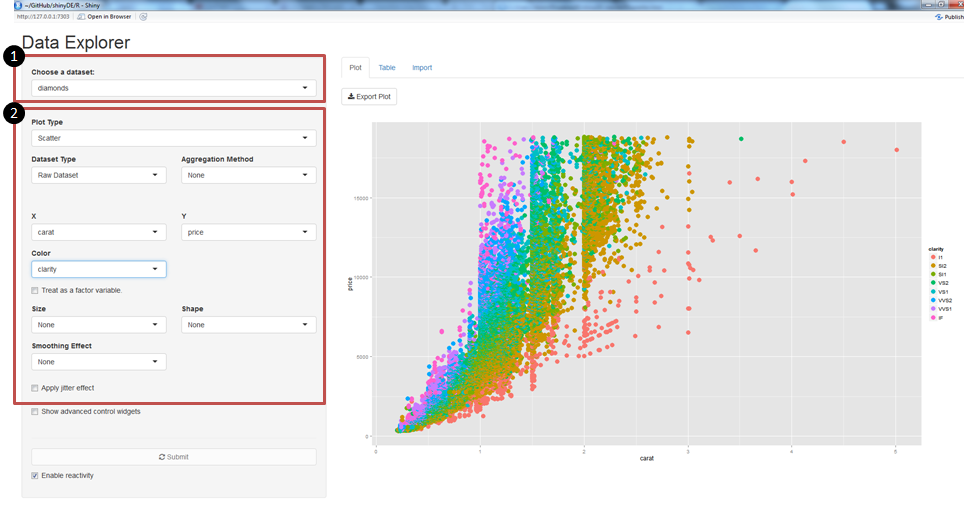
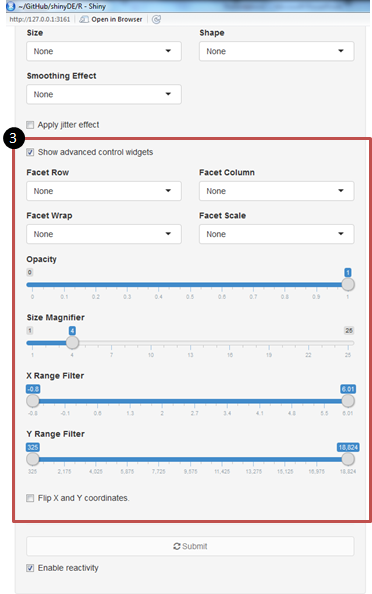
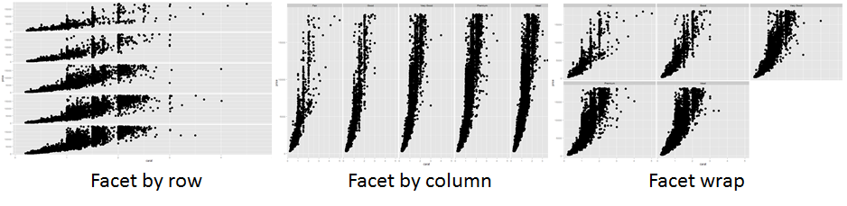

# Visual Explorer
##A Flexible Interface for Data Visualisation and Analysis

This vignette provides a guide to the ShinyDE package. It describes the situations where the package can be applied and provides context in terms of package design and application. It also provides examples of the package in action.  

## Overview
ShinyDE is an open source R package providing a graphical user interface for data exploration and visualisation. It is based on principles of visualization analysis by Tamara Munzner, and also acts as a wrapper for functionality implemented in the grammar of graphics for R, ggplot2.

Ggplot2 offers a wide array of marks and channels that constitute the building blocks for developing visual encodings, as well as a large selection of built-in visual idioms. However, users unfamiliar with the package may not have visibility of the options available to them, or find it challenging to express their envisioned design in their desired visual idiom.
 
ShinyDE is designed to handle a spectrum of data visualisation needs ranging from visualising the raw values of individual variables through to fully aggregated, pivot-table style visualisations. Data volume and visual complexity is handled by the implementation of two approaches to handle visual complexity - faceting into multiple views, and reduction of items and attributes.

## Toolbar

The toolbar has three sections:

1. Loading data
2. Basic visual encoding (single visualisation)
3. Advanced interactivity and faceting (multiple visualisation)

The first two are shown in the screenshot below:

### 1. Loading data

To load data, either use a pre-loaded dataset from the 'Choose a dataset' dropdown, or click on the import tab and upload your own dataset using the buttons shown below.

### 2. Basic Visual Encoding

A typical sequence of basic actions would be:

* Select a dataset
* Select a plot type (aka visual idiom)
* Select whether to plot raw data items, or aggregations of data
* Select data attributes for the X axis and Y axis

Optionally: 

* Select further attributes for encoding via other visual channels
* Apply jitter effects to facilitate visual analysis*

*Note: The 'jitter' effect is often used to enhance visual interpretability when dealing with a larger data sets with many overlapping data points. In this case, jittering would surface the relative densiry of points around each overlapping data point.

### 3. Advanced Faceting and Interactivity

Click on the 'Show advanced control widgets' to display controls for presenting a multi-plot data visualisation. 

There are two faceting alternatives available to users:

* Use the facet row and/or facet column dropdowns to select variables to build multiple visualisations , OR 
* Use the facet wrap dropdown to direct the package to automatically select an optimal number of rows and columns that will seek to preserve the dimensions of the original plot.

The differences are shown below:

Optionally, the facet scale functionality allows the DE the freedom to re-scale the X-axis and/or Y-axis within each facet grid.

This is useful to improve visual clarity if the relative values of data attributes do not make good use of the visualisation space. However, caution should be taken as this may lead to misleading interpretations for the casual observer who misses the different scales used.

The other advanced control widgets are largely self-explanatory.

### Change and Submit vs. Dynamic Refreshing

A 'Submit' button and an 'Enable reactivity' checkbox at the bottom of the toolbar caters to user preferences. By default, the visualisation refreshes whenever there is a change to the dataset or any input widget. 

However, it may be advantageous at times to only generate the visualisation once multiple visualisation parameters have been tweaked (e.g. in the case of large datasets that take a while to render). In this case, the 'Enable reactivity' checkbox should be unchecked, and multiple changes can be made before clicking on the 'Submit' button.