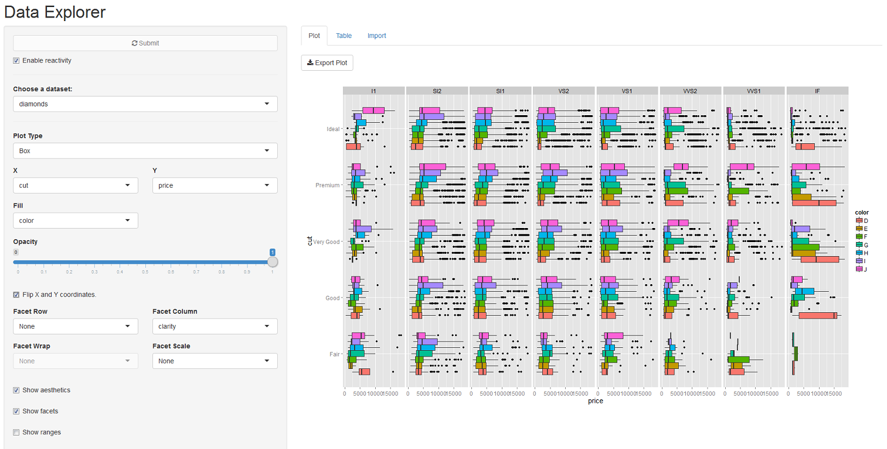
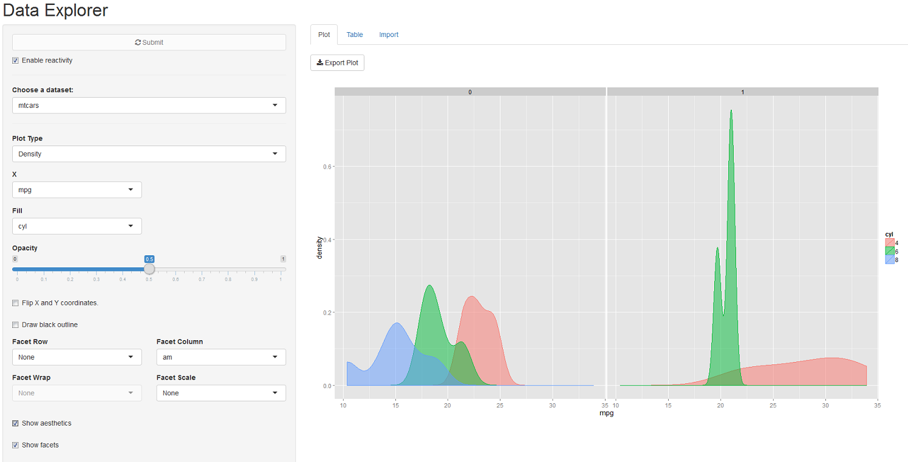

```{r, include = FALSE}
knitr::opts_chunk$set(collapse = TRUE, comment = "#>")
library(ggraptR)
```

# ggraptR: Rapid And Pretty Things in R

## A Flexible Interface for Data Visualisation and Analysis

This vignette provides a guide to the ggraptR package. It describes the situations where the package can be applied and provides context in terms of package design and application. It also provides examples of the package in action.  

## Overview
ggraptR is an open source R package providing a graphical user interface for data exploration and visualisation. It is based on principles of visualization analysis by Tamara Munzner, and also acts as a wrapper for functionality implemented in the grammar of graphics for R, ggplot2.

ggplot2 offers a wide array of marks and channels that constitute the building blocks for developing visual encodings, as well as a large selection of built-in visual idioms. However, users unfamiliar with the package may not have visibility of the options available to them, or find it challenging to express their envisioned design in their desired visual idiom.
 
ggraptR is designed to handle a spectrum of data visualisation needs ranging from visualising the raw values of individual variables through to fully aggregated, pivot-table style visualisations. Data volume and visual complexity is handled by the implementation of two approaches to handle visual complexity - faceting into multiple views, and reduction of items and attributes.

## Workflow

The standard workflow in ggraptR consists of

1. Importing data (from an R dataset or a flat file)
2. Producing and customisation a data visualisation using the Plot toolbar
3. Exporting the completed visualisation as an image file

### Reactivity and large data sets


By default, the visualisation refreshes whenever there is a change to the dataset or any input control.

However, when dealing with large datasets that take awhile to render it may be advantageous to only generate the visualisation once multiple controls have been tweaked. In this case, the 'Enable reactivity' checkbox should be unchecked, and multiple changes can be made before clicking on the 'Submit' button.

## 1. Importing Data

There are two options for importing data. The preferred way is to load a dataset into a data frame within the R environment. All loaded data frames will be available to ggraptR when ggraptR is launched. 

To check which data frames are available, click on the dropdown underneath 'Choose a dataset'. A number of pre-loaded datasets along with any data frames within the R environment should be shown. For users of RStudio, these can be found under the environment tab (next to history and build). 

If your data is present in the environment and not in ggraptR, you should confirm if the data type is data frame using the command:

```
class(my_data_frame)
```

where 'my_data_frame' is the name of your data. 

If it is not of type "data.frame" then you can coerce it using

```{r eval=FALSE}
data_frame_name <- as.data.frame(my_data_frame)
```

where 'my_data_frame' is the name of your data and 'data_frame_name' is the name of your data when saved into a data frame format. 

To load a csv file into a new data frame, read data in csv format using the read.csv command:

```{r eval=FALSE}
data_frame_name <- read.csv("data_to_be_imported.csv")
```

where 'data_frame_name' is your preferred name for the dataset to be loaded and 'data_to_be_imported' is the name of the csv file containing the dataset. The csv file should be located in the working directory.

Alternatively, you may import a dataset, by clicking on the import tab as shown:


Click 'choose file', and select the required file. 

If the first row of the file contains header names, make sure the checkbox next to 'Header' is ticked.

Choose the appropriate Quote and Separator buttons depending how quotes and delimiters are used in the flat file. 

Note that the options default to a header, double quote and comma separated variables (CSV). 

Once the file is uploaded, an 'Upload complete' bar will be shown. The dataset will immediately become available in the 'Choose a dataset' dropdown.

## 2. Data Explorer Toolbar

The toolbar has four sections:

1. Choosing a dataset
2. Basic plotting (single visualisation)
3. Advanced visual encoding (aesthetics and themes, faceting, zoom-in)
4. Aggregation

### 2.1 Choosing a dataset

To choose a dataset for visualiastion, select a dataset from the 'Choose a dataset' dropdown. You should see a number of pre-loaded R datasets along with any active data frames in your environments and  the most recent file you uploaded.

### 2.2 Basic Plotting

To plot raw data, simply:

* Select a dataset
* Select a plot type (aka visual idiom)
* Select data attributes for the X axis and Y axis

Please refer to Appendix A further down this page for recommendations for the use of individual visual idioms.


### 2.3 Advanced visual encoding

#### 2.3.1 Aesthetics and Themes

Click on the 'Show aesthetics' box to explore a number of options to improve plot aesthetics, or the 'Show themes' box to customise plot label aesthetics.

'Show aesthetics' reveals the following controls:

* Additional attributes can be selected for encoding via other visual channels (colour, size and shape)
* Opacity and point size can be adjusted
* Jitter effects can be applied to facilitate visual analysis

Note: The 'jitter' effect is often used to enhance visual interpretability when dealing with a larger data sets with many overlapping data points. In this case, jittering would reveal the relative density of points around each overlapping data point.


If data appears cluttered or overly spaced out in the plot, check the 'Flip X and Y coordinates' box to explore swapping axes. 

'Show themes' reveals the following controls:

* Axis font labels and positioning can be adjusted
* Built-in themes can be used as a starting point for further customisation


Note that the "Enable reactivity" checkbox needs to be disabled in order to edit the axes labels and plot title.

#### 2.3.2 Faceting

Click on the 'Show facets' check box to display controls for presenting a multi-plot data visualisation. 


There are two faceting alternatives available to users:

* Use the facet row and/or facet column dropdowns to select variables to build multiple visualisations , OR 
* Use the facet wrap dropdown to direct the package to automatically select an optimal number of rows and columns that will seek to preserve the dimensions of the original plot.

The differences are shown below:


Optionally, the facet scale functionality allows the DE the freedom to re-scale the X-axis and/or Y-axis within each facet grid.

This is useful to improve visual clarity if the relative values of data attributes do not make good use of the visualisation space. However, caution should be taken as this may lead to misleading interpretations for the casual observer who misses the different scales used.


#### 2.3.3 Zoom-in

Click on the 'Show ranges' check box to display controls for zooming in on a subset of the plot. 


The two sliders can be dragged to restrict the range of the data shown. The visualisation area will scale so that the subsetted range will be shown over the full area.

An example of this control in action is shown below:


#### 2.4 Aggregation

Aggregation controls are used to simulate pivot chart functionality. 

To plot aggregated measures of data, check the 'Show dataset type and aggregation method' box. 

The 'Dataset Type' dropdown can be ignored.

Select the desired aggregation method from the dropdown menu.


The aggregation contol applies a function to transform raw data into count data or calculated values. 


## 3. Export Plot

Once the visualisation is complete, click on 'Export Plot' to save the visualisation. The 'Export Options' dialogue box will appear.


Select the dimensions and file type for the exported file and click 'Download' to save it to your local machine. 

*Known issue: Machines running on Windows may not be able to save plots if they are running ggraptR from RStudio. If this is the case, click 'Open in Browser' to enable export functionality.*

*Known issue: The Export Options dialogue box may not appear for machines running on Windows. However the file can still be saved using the workaround above.*

# Worked Examples

To see the functionality working in unison, the following are two examples. 

Example 1: Faceted boxplots

* Choose the dataset diamonds
* Select Box plot
* Select Cut as the X axis
* Select Price as the Y axis
* Click the 'Show aesthetics' checkbox
* Select Colour as the fill
* Click the 'Show facets' checkbox
* Select Clarity under 'Facet Column'
* Click 'Flip X and Y coordinates'



Example 2: Faceted boxplots

* Choose the dataset mtcars
* Select Density plot
* Select mpg (miles per gallon) as the X axis
* Click the 'Show aesthetics' checkbox
* Select cyl (number of cylinders) as the fill
* Click the 'Show facets' checkbox
* Select am (automatic/manual) under 'Facet Column'
* Set transparency to 0.5



### Questions and issues

This vignette was authored by Jason Widjaja and Eugene Dubossarsky. Any questions and issues may be directed to : eugene@presciient.com

### Appendix A: Guide to Visual Idiom Choices


Idiom:         | Scatterplots
-------------  | ------------ 
Data:          | Two quantitative value attributes   
Encoding:      | Express values with horizontal and vertical spatial position and point marks
Task:          | Find trends, outliers, distribution, correlation; locate clusters
Scale          | Hundreds of items


Idiom:         | Bar Charts
-------------  | ------------ 
Data:          | One quantitative value attributes, one categorical key attribute
Encoding:      | Express value attribute with aligned vertical position, separate key attribute with horizonal position
Task:          | Lookup and compare values
Scale          | Dozens to hundreds of levels


Idiom:         | Stacked Bar Charts
-------------  | ------------ 
Data:          | Multidimensional table: one quantitative value attributes, two categorical key attributes
Encoding:      | Bar with length-coded subcomponents of value attribute for each category of secondary key attribute. Separate bars by category of primary key attribute.
Task:          | Part-to-whole relationship, lookup values, find trends
Scale          | Main axis: Dozens to hundreds of levels. Stacks: Several to one dozen 


Idiom:         | Line Charts
-------------  | ------------ 
Data:          | One quantitative value attribute, one ordered key attribute
Encoding:      | Dot chart with connection marks between dots 
Task:          | Show trends
Scale          | Hundreds of levels


Idiom:         | Scatterplot Matrix (SPLOM)
-------------  | ------------ 
Data:          | Two quantitative value attributes for each plot, one categoric variable for row facet and one categoric variable for column facet
Encoding:      | Scatterplots in 2D matrix alignment
Task:          | Find correlation, trends, outliers
Scale          | Attributes: one dozen. Items: dozens to hundreds


